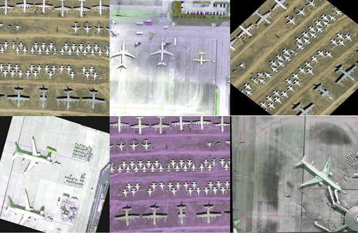

## :bulb:Preparation images and their associated annotations for training, evaluation and testing phase

 * -Img_Augmentation script is used to generate rotation/horizontal/vertical flip to realize augmentation.
 * -ImgSplit_multi_process script is used to split whole pictuers to some sub pictuers in various size and scale.

## :bulb:The augmented images with 768*768 size in two scales (1.0, 0.6) 
