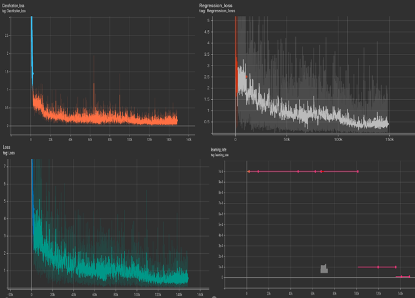

# :dart:_Rotatated airplane Detector based on EfficientDet_   

This **rotation airplane detector** implemented and modified based on [pytorch implementing EfficientDet(horizontal)](https://github.com/zylo117/Yet-Another-EfficientDet-Pytorch) and you can find original paper [here](https://arxiv.org/abs/1911.09070 "EfficientDet").

## :dart:My Experiment
  Prepare airplane dataset for Task1-Detection with oriented bounding boxes[DOTA dataset](https://captain-whu.github.io/DOTA/)

  
- evaluation metrics  

|coefficient|Input Size|mAP(iou=.5)|
|:---------:|:--------:|:---------:|
|D2         |768 x 768 |0.874      |

- loss curve
 
 Totall loss =  regression loss + clasification loss
 
  

### Outputs of rotated airplane detector

- Correct detection for all airplanes 
 
   
      
- Detection of airplanes along with some error
 
   


## :dart:Installation 

### 1. Install requirements:
```
conda create -n Rotateairplanedetection python=3.9  
conda activate Rotateairplanedetection  
conda install pytorch==1.7.0 torchvision==0.8.0 torchaudio==0.7.0 cudatoolkit=11.0 -c pytorch
pip install -r path to /requirements.txt  

Note: If you meet some troubles about installing environment, you can see the check.txt for more details.  
```
### 2. Install skew iou module:
```
cd polyiou
sudo apt-get install swig
swig -c++ -python polyiou.i
python setup.py build_ext --inplace
```
### 3. Install rotation nms module:
```
cd utils/nms
make
```

## :dart:Train 
train procces is based on this great [repo](https://github.com/zylo117/Yet-Another-EfficientDet-Pytorch)
### A. Prepare dataset  
you should put your dataset into `datasets` folder and the file tree is below.
```
# dataset structure should be like this
datasets/
    -your_project_name/
        -train_set_name/
            -*.jpg
        -val_set_name/
            -*.jpg
        -annotations
            -instances_{train_set_name}.json
            -instances_{val_set_name}.json

# for example, coco2017
datasets/
    -coco2017/
        -train2017/
            -000000000001.jpg
            -000000000002.jpg
            -000000000003.jpg
        -val2017/
            -000000000004.jpg
            -000000000005.jpg
            -000000000006.jpg
        -annotations
            -instances_train2017.json
            -instances_val2017.json
```
### B. Manual set project's hyper parameters
you should create your own yml file under `projects` folder. My experiment yml file is `rotation_vehicles.yml`.
```
# create a yml file {your_project_name}.yml under 'projects' folder
# modify it following 'coco.yml'

# for example
project_name: coco
train_set: train2017
val_set: val2017
num_gpus: 4  # 0 means using cpu, 1-N means using gpus

# mean and std in RGB order, actually this part should remain unchanged as long as your dataset is similar to coco.
mean: [0.485, 0.456, 0.406]
std: [0.229, 0.224, 0.225]

# this is coco anchors, change it if necessary
anchors_scales: '[2 ** 0, 2 ** (1.0 / 3.0), 2 ** (2.0 / 3.0)]'
anchors_ratios: '[(1.0, 1.0), (1.4, 0.7), (0.7, 1.4)]'

# objects from all labels from your dataset with the order from your annotations.
# its index must match your dataset's category_id.
# category_id is one_indexed,
# for example, index of 'car' here is 2, while category_id of is 3
obj_list: ['person', 'bicycle', 'car', ...]

```
### C.1 Train rotation detector on a custom dataset from scratch
```
# train rotation efficientdet-d0 on a custom dataset
# with batchsize 32 and learning rate 5e-3

python train.py -c 0 -p your_project_name --train_batch_size 32 --lr 5e-3
```
### C.2 Train rotation detector with pretrained weight file which is trained on horizontal datasets.
you should download the pretrained horizontal detector weight file and put this pth file into `weights` folder.
```
# train rotation efficientdet-d0 on a custom dataset with pretrained weights which is trained on horizontal datasets.
# with batchsize 32 and learning rate 5e-3 for 10 epoches

python train.py -c 0 -p your_project_name --train_batch_size 32 --lr 5e-3 --num_epochs 10 \
 --load_weights /path/to/your/weights/efficientdet-d0.pth

# with a pretrained weight file, you can even freeze the backbone and train heads only
# to speed up training and help convergence.

python train.py -c 0 -p your_project_name --train_batch_size 32 --lr 5e-3 --num_epochs 10 \
 --load_weights /path/to/your/weights/efficientdet-d0.pth \
 --head_only True
```
### D. Early stopping a training session.
```
# while training, press Ctrl+c, the program will catch KeyboardInterrupt
# and stop training, save current checkpoint.
```
### E. Resume Training
```
# let says you started a training session like this.

python train.py -c 0 -p your_project_name --train_batch_size 32 --lr 5e-3 \
 --load_weights /path/to/your/weights/efficientdet-d0.pth \
 --head_only True

# then you stopped it with a Ctrl+c, it exited with a checkpoint

# now you want to resume training from the last checkpoint
# simply set load_weights to 'last'

python train.py -c 0 -p your_project_name --train_batch_size 16 --lr 1e-3 \
 --load_weights last \
 --head_only False
```
## :dart:Evaluation
The evaluation stage is implemented based on the following [paper](https://ieeexplore.ieee.org/abstract/document/9145130)

### file structure of evaluation stage
```
evaluation/
    -gt_labels/
        -*.txt
    -result_classname
        -Task1_{category_name}.txt
    -batch_inference.py
    -eval.py
    -imgnamefile.txt
    -prepare.py
```


## :bulb:References
The main framework of this project is based on the following very informative repository.
[Yet-Another-EfficientDet-Pytorch](https://github.com/zylo117/Yet-Another-EfficientDet-Pytorch)


